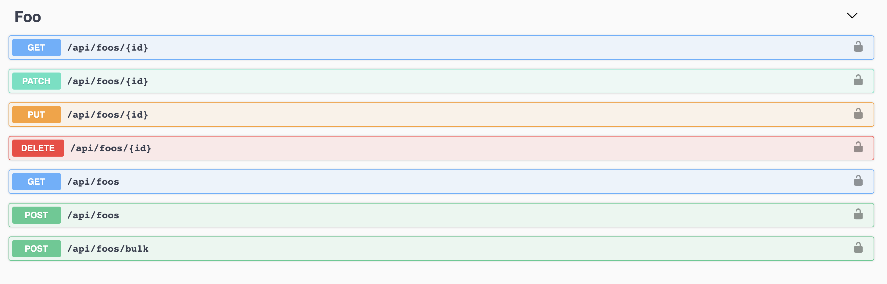

## Description

Api starter, built on top of <a href="https://nestjs.com/">nest</a> and <a href="https://github.com/nestjsx/crud">nextjsx-crud</a> packages. Enables rapid REST API development and automates openapi docs and client generation. Comes bundled with OmniDB database manager

## Creating layered CRUD

First define an entity in the following way (it will inherit id and created updated columns from BaseEntity class):

```ts
@Entity('foos')
export class Foo extends BaseEntity {
  @Column({ name: 'temp', type: 'int' })
  @ApiProperty({ name: 'temp', type: 'number' })
  temp: number;
}
```

Then define a service for this entity

```ts
@Injectable()
export class FooService extends TypeOrmCrudService<Foo> {
  constructor(@InjectRepository(Foo) repo) {
    super(repo);
  }
}
```

And a Controller

```ts
@Controller(Foo)
export class FooController implements CrudController<Foo> {
  constructor(public service: FooService) {}
}
```

And that is it! This will create a CRUD controller that allows basic manipulation with this entity. It will generate openapi(swagger) docs



And a axios-typescript API wrapper that can be used in the following way

```ts
import { FooApi } from '../client/api';

const fooApi = new FooApi();

const foo = await fooApi.getFoo({ id: 5 });
const foos = await fooApi.getFoos({ page: 1, limit: 100 });
const newFoo = await fooApi.createFoo({ foo: { name: 'foo' } });
const newFoos = await fooApi.createFoos({ createManyFooDto: { bulk: [{ name: 'foo' }] } });
const updatedFoo = await fooApi.updateFoo({ id: 5, foo: { name: 'foo2' } });
const replaceFoo = await fooApi.replaceFoo({ id: 5, foo: { name: 'foo2' } });
const noFoo = await fooApi.removeFoo({ id: 5 });
```

## Installation

```bash
$ yarn
```

## Running the app

Rename `env.example` to `.env`

```bash
# development
$ yarn start:dev

# debug mode
$ npm run start:debug

# production mode
$ npm run start:prod
```

## Database

```bash
docker-compose up
# to create a superuser for omnidb
docker exec -it rest_supercharger_omnidb_1 python omnidb-server.py --createsuperuser=admin pass
```

## OmniDB

Navigate to `0.0.0.0:8081` (localhost doesn't work). Login with superuser admin/pass
When adding a connection keep in mind that `omnidb` is running in docker so postgres is not accesible at at `localhost:5432` but `postgres:5432`

## Test

```bash
# unit tests
$ npm run test

# e2e tests
$ npm run test:e2e

# test coverage
$ npm run test:cov
```
